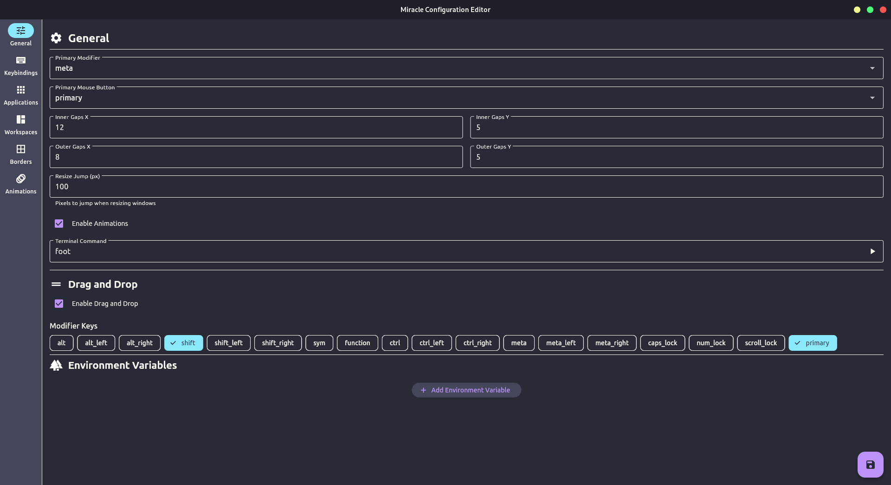

# Miracle Settings

A graphical frontend for configuring [miracle-wm](https://github.com/miracle-wm-org/miracle-wm).



## Dependencies
- `libmiracle-wm-config.so.1`

## Building

```sh
flutter pub get get
flutter build linux --release
```

or

```sh
export FLUTTER = path/to/flutter
make build
```

## Installing
```sh
sudo make install
```

## Configuring
Miracle Settings uses a TOML file to configure itself. This file is most likely
going to wind up in `$HOME/.config/miracle-settings/config.toml` the first time
that you run Miracle Settings, however it may wind up somewhere else depending
on how you configured your system. [Check the XDG Base Directory Specification](https://specifications.freedesktop.org/basedir-spec/latest/)
to see where it may end up for you.

Valid keys in this file are:

```toml
config_file_path = "path/to/your/miracle-wm.yaml" # defaults to $HOME/.config/miracle-wm/config.yaml
```
